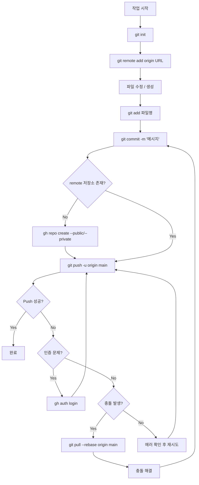
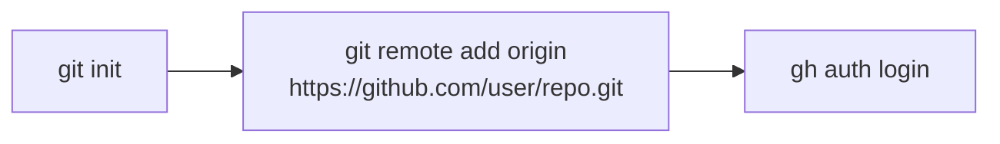
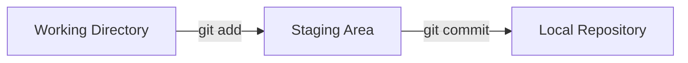
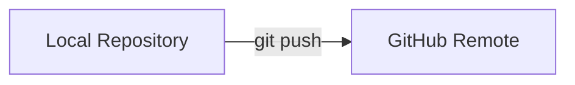
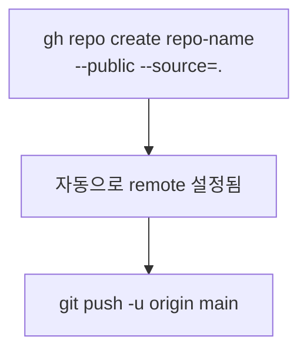
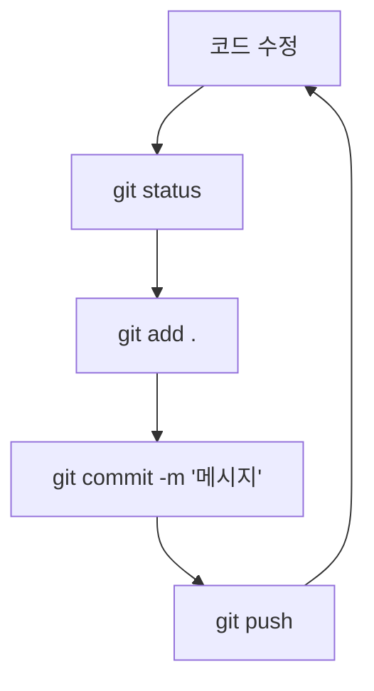

# Git & GitHub CLI(gh)를 사용한 Push 과정

## 전체 흐름도

## 단계별 명령어

### 1. 초기 설정

| 단계 | 명령어 | 설명 |
|------|--------|------|
| 저장소 초기화 | `git init` | 로컬 Git 저장소 생성 |
| 원격 연결 | `git remote add origin <URL>` | GitHub 원격 저장소 연결 |
| 인증 | `gh auth login` | GitHub CLI 인증 |

### 2. 스테이징 & 커밋

| 단계 | 명령어 | 설명 |
|------|--------|------|
| 상태 확인 | `git status` | 변경된 파일 확인 |
| 파일 추가 | `git add 파일명` | 스테이징 영역에 추가 |
| 전체 추가 | `git add .` | 모든 변경 파일 추가 |
| 커밋 | `git commit -m "메시지"` | 변경사항 커밋 |

### 3. Push (원격 저장소 전송)

| 단계 | 명령어 | 설명 |
|------|--------|------|
| 최초 Push | `git push -u origin main` | 업스트림 설정 및 Push |
| 이후 Push | `git push` | 변경사항 Push |

### 4. gh CLI로 저장소 생성 (원격 저장소가 없을 때)

| 단계 | 명령어 | 설명 |
|------|--------|------|
| 공개 저장소 | `gh repo create 이름 --public --source=.` | 공개 저장소 생성 |
| 비공개 저장소 | `gh repo create 이름 --private --source=.` | 비공개 저장소 생성 |
| 저장소 확인 | `gh repo view` | 저장소 정보 확인 |

### 5. 일반적인 작업 사이클

